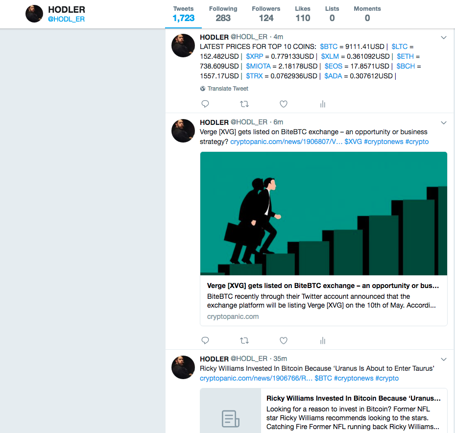

# Crypto Twitter Bot

### This is a twitter bot that will tweet real time cryptocurrency prices, data, and news. 

It uses the [CoinMarketCap API](https://coinmarketcap.com/api/) to get the latest prices for the top 10 coins. It uses the [CryptoPanic API](https://cryptopanic.com/about/api/) to get the latest crypto related news. It uses the [Twitter API](https://developer.twitter.com/en/docs/api-reference-index) to post, find, and retweet tweets. 

Upon running the bot, it will run `tweetLatestPrices()` which is the function that tweets the latest prices. Then, I am using the `setInterval()` Javascript function to have the bot tweet the latest prices every hour. I am calling the `tweetLatestCryptoNews()` function every 29 minutes to update users with the latest news. Lastly, I am running the `retweetMostRecentTweets()` function every 3.9 hours to search for and tweet the two most recent relating to crypto. I am setting different intervals so that the bot does not tweet two tweets at the same time. Twitter is pretty good for preventing duplicate tweets though. I can also manipulate the params object to search for different things. For example,

```
var params = {
    q: '#crypto',
    count: 2,
    result_type: 'recent',
    lang: 'en'
}
```

Here I can change `q:` to any hashtag or word that I want to look for. `count` is the number of tweets I want to look for. I can set `result_type` to recent or popular to search for the most recent or popular tweets.


**These are screen shots of the bot tweeting on its own every so often depending on the time interval that I set or the functions that I run independently**




